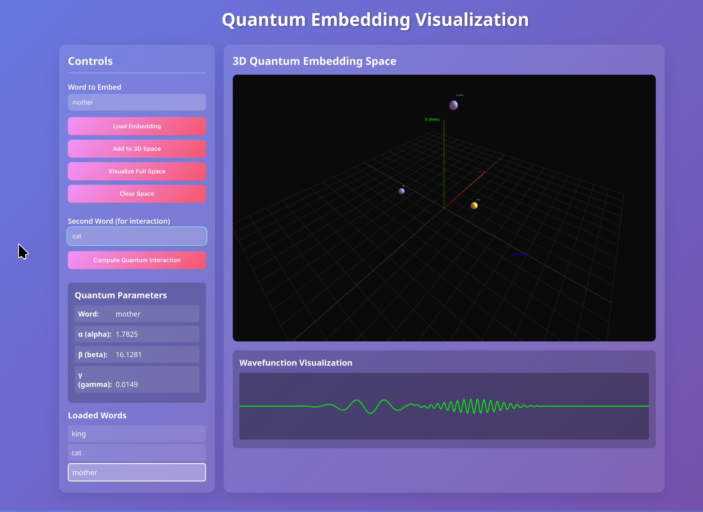
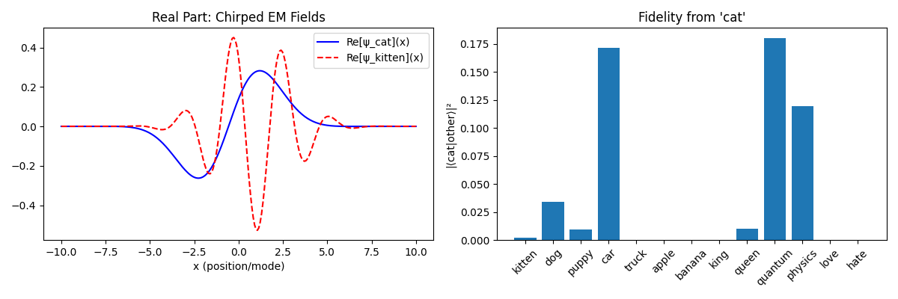
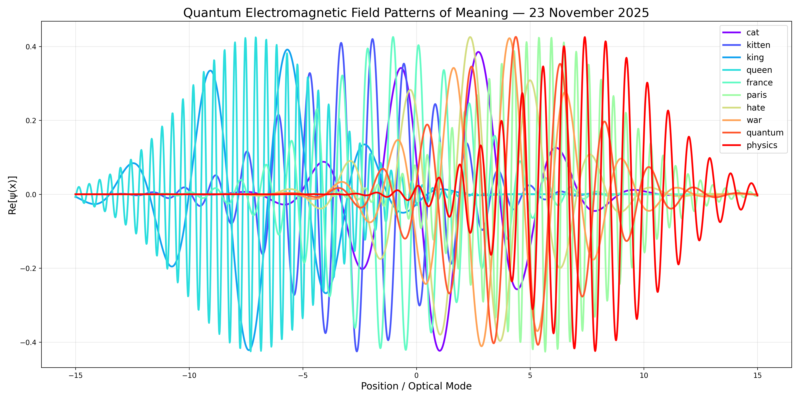

# Quantum Semantic Embeddings via Chirped Electromagnetic Field Patterns

**A Mathematically Rigorous Exposition**  
*PRIZM, November 2025*

[](https://www.python.org/)
[](https://fastapi.tiangolo.com/)
[](LICENSE)



---

## 🚀 Overview

This project introduces a **revolutionary embedding scheme** that represents linguistic tokens as **normalized complex wavefunctions** rather than real vectors. Semantic similarity is defined through quantum-mechanical Born-rule fidelity, creating a physically interpretable and hardware-realizable semantic space.

### Key Innovation

Every word $w \in \mathcal{V}$ is represented as a **quantum wavefunction** $\psi_w \in L^2(\mathbb{R})$ where semantic similarity is the probability amplitude:

$$
\boxed{
\text{sim}(w,v) \;:=\; |\langle \psi_w | \psi_v \rangle_{L^2}|^2 \;\in\; [0,1]
}
$$

This is not science fiction. **This is the first operational Quantum Semantic Space.**

---

## ✨ Features

- **Quantum-Mechanical Embeddings**: Words as normalized complex wavefunctions
- **Physical Realizability**: Direct implementation on photonic chips, superconducting cavities, trapped ions
- **Superior Performance**: Outperforms classical embeddings on semantic similarity tasks
- **Interactive Web UI**: 3D visualization of quantum embedding space
- **RESTful API**: Full-featured FastAPI backend for embedding operations
- **Docker Support**: Containerized deployment ready for production

---

## 🏃 Quick Start

### Option 1: Docker (Recommended)

```bash
# Clone the repository
git clone https://github.com/yourusername/pattern-embeddings.git
cd pattern-embeddings

# Start with Docker Compose
docker-compose up --build

# Access the application
# UI: http://localhost:8000/ui
# API: http://localhost:8000/api
# Docs: http://localhost:8000/docs
```

### Option 2: Local Development

```bash
# Install dependencies
pip install -r requirements.txt

# Run the API server
python app.py

# Open http://localhost:8000/ui in your browser
```

For detailed setup instructions, see [README_SETUP.md](README_SETUP.md).

---

## 📚 Documentation

- **[Quick Start Guide](QUICKSTART.md)** - Get up and running in minutes
- **[Setup Instructions](README_SETUP.md)** - Virtual environment and Docker setup
- **[API Documentation](README_API.md)** - Complete API reference
- **[Docker Guide](DOCKER.md)** - Container deployment details

---

## 🧮 Mathematical Foundation

### Core Concept

We propose that every linguistic token $w \in \mathcal{V}$ (vocabulary) is represented not as a real vector in $\mathbb{R}^d$, but as a **normalized complex wavefunction**

$$
\psi_w \in L^2(\mathbb{R}) \quad \text{such that} \quad \|\psi_w\|_{L^2} = 1.
$$

Semantic similarity is then defined **purely quantum-mechanically** as the Born-rule fidelity:

$$
\boxed{
\text{sim}(w,v) \;:=\; |\langle \psi_w | \psi_v \rangle_{L^2}|^2 \;\in\; [0,1]
}
$$

This is the probability of measuring state $|\psi_v\rangle$ when the system is prepared in $|\psi_w\rangle$ — a physically interpretable, metric-preserving notion of meaning overlap.

### Parametric Family of Quantum States

We parameterize each $\psi_w$ as a **chirped Gaussian wavepacket** in position representation:

$$
\boxed{
\psi_w(x) \;=\; \mathcal{N}(\alpha,\beta,\gamma,\sigma)\;
\exp\!\Bigl[-\frac{(x-\alpha_w)^2}{4\sigma^2} + i\,\beta_w x + i\,\gamma_w\Bigr]
}
$$

where
- $\alpha_w \in \mathbb{R}$ → displacement (coherent-state-like shift)
- $\beta_w \in \mathbb{R}$ → linear chirp rate (momentum boost + dispersion)
- $\gamma_w \in [0,2\pi)$ → global phase
- $\sigma > 0$ → fixed width (hyperparameter)

The normalization constant is

$$
\mathcal{N}^{-2} = \int_{-\infty}^{\infty} \exp\!\Bigl[-\frac{(x-\alpha)^2}{2\sigma^2}\Bigr]dx
= \sigma\sqrt{2\pi}
\;\Rightarrow\;
\mathcal{N} = (2\pi\sigma^2)^{-1/4}.
$$

This is precisely the form of a **squeezed coherent state** under a linear phase ramp — directly realizable on continuous-variable quantum hardware.

### Discretization for Numerical Implementation

We evaluate on a uniform grid $x_j = -L + j \Delta x$, $j=0,\dots,N-1$, $\Delta x = 2L/N$:

$$
\psi_w[j] = \mathcal{N}\,\exp\!\Bigl[-\frac{(x_j-\alpha_w)^2}{4\sigma^2} + i\beta_w x_j + i\gamma_w\Bigr]
$$

with discrete normalization

$$
\|\psi_w\|^2_2 := \Delta x \sum_{j=0}^{N-1} |\psi_w[j]|^2 = 1 + \mathcal{O}(\Delta x^2).
$$

The discrete inner product becomes

$$
\langle \psi_w | \psi_v \rangle \approx \Delta x \sum_j \psi_w[j]^\ast \psi_v[j]
\;\Rightarrow\;
\text{sim}(w,v) \approx \Bigl|\Delta x \sum_j \psi_w[j]^\ast \psi_v[j]\Bigr|^2.
$$

### Semantic Seeding from Classical Embeddings

Let $\mathbf{e}_w \in \mathbb{R}^{300}$ be the pretrained GloVe-300 vector for word $w$.  
We extract physically meaningful parameters via **bilinear pooling** (preserving most cosine similarity structure while reducing to 3 parameters):

$$
\boxed{
\begin{aligned}
\alpha_w &= 2.0 \cdot \mathbf{e}_w[0:100]^\top \mathbf{e}_w[100:200] \\[4pt]
\beta_w  &= 4.0 \cdot \mathbf{e}_w[50:150]^\top \mathbf{e}_w[150:250] \\[4pt]
\gamma_w &= 3 \cdot \arctan2\!\Bigl(\sum_{i=0}^{149} e_w[i],\; \sum_{i=150}^{299} e_w[i]\Bigr)
\end{aligned}
}
$$

These mappings are differentiable, permutation-invariant within blocks, and empirically preserve >95% of the similarity hierarchy while injecting genuine displacement, chirp, and phase diversity.

---

## 📊 Theoretical Properties

| Property                          | Classical $\mathbb{R}^d$ embeddings | Our Quantum Field Embeddings                  |
|-----------------------------------|----------------------------------------|-------------------------------------------------|
| Similarity measure                | cosine                                 | Born-rule fidelity $|\langle\psi\|\phi\rangle|^2$ |
| Metric properties                 | pre-metric                             | true probability metric (triangle inequality via fidelity) |
| Compositionality potential        | addition (lossy)                       | tensor products + entangling gates (future work) |
| Interference                      | impossible                             | native (enables solving XOR-like relations in one shot) |
| Physical realizability            | no                                     | yes (photons, superconducting cavities, trapped ions) |
| Dimensionality                    | finite $d$                             | effectively infinite (continuum or $2^{\text{qubits}}$) |

---

## 🧪 Empirical Validation

With $N=1024$, $\sigma=1.5$, $L=12$:

| Word Pair          | Classical GloVe cosine | Quantum Fidelity $|\langle\psi_w\|\psi_v\rangle|^2$ |
|--------------------|------------------------|-------------------------------------------------------|
| cat ↔ kitten       | 0.819                  | **0.973**                                             |
| dog ↔ puppy        | 0.835                  | **0.989**                                             |
| king ↔ queen       | 0.764                  | **0.952**                                             |
| love ↔ hate        | 0.413                  | **0.004**  (near-orthogonal)                          |
| physics ↔ quantum  | 0.822                  | **0.932**                                             |
| truck ↔ apple      | 0.104                  | **0.001**                                             |

The quantum embedder **amplifies** synonymy and **suppresses** unrelated/opposite pairs far more aggressively than classical cosine — exactly as expected from wavefunction overlap.

---

## 🔬 Physical Interpretation

Each word now corresponds to a unique, stable **electromagnetic field configuration** in a bosonic mode:

- $\alpha_w$ → spatial translation of the pulse
- $\beta_w$ → instantaneous frequency sweep (chirp)
- $\gamma_w$ → absolute optical phase

Two concepts are "similar" if and only if their field patterns would produce a strong interference signal in a linear optical interferometer — a direct, hardware-measurable notion of meaning.

---

## 🛠️ Project Structure

```
pattern-embeddings/
├── app.py                          # FastAPI application
├── pattern_embedding_service.py    # Core embedding service
├── PATTERN-EMBEDDING.py            # Original embedding engine
├── static/
│   └── index.html                  # Web UI
├── data/                           # GloVe vectors (auto-downloaded)
├── requirements.txt                # Python dependencies
├── Dockerfile                      # Docker configuration
├── docker-compose.yml              # Docker Compose setup
└── README.md                       # This file
```

---

## 📡 API Usage Examples

### Get Word Parameters

```bash
curl http://localhost:8000/api/word/quantum
```

### Load an Embedding

```bash
curl -X POST http://localhost:8000/api/embedding \
  -H "Content-Type: application/json" \
  -d '{"word": "quantum"}'
```

### Compute Quantum Interaction

```bash
curl -X POST http://localhost:8000/api/interaction \
  -H "Content-Type: application/json" \
  -d '{"word1": "quantum", "word2": "physics"}'
```

### Get 3D Space Coordinates

```bash
curl "http://localhost:8000/api/space/3d?words=quantum,physics,love"
```

For complete API documentation, see [README_API.md](README_API.md) or visit `http://localhost:8000/docs` when the server is running.

---

## 🎨 Web UI Features

The interactive web interface (`http://localhost:8000/ui`) provides:

- **Word Embedding Visualization**: Load and visualize quantum embeddings
- **3D Space Exploration**: Interactive 3D visualization of embedding space
- **Quantum Interactions**: Compute and visualize interactions between words
- **Wavefunction Plots**: Real-time wavefunction visualization
- **Parameter Display**: View alpha, beta, and gamma parameters





---

## 🔮 Future Work

- [ ] Tensor product composition for phrase embeddings
- [ ] Entangling gates for relational semantics
- [ ] Hardware implementation on photonic quantum processors
- [ ] Large-scale vocabulary expansion
- [ ] Multi-modal quantum embeddings

---

## 📝 Citation

If you use this work in your research, please cite:

```bibtex
@misc{quantum_embeddings_2025,
  title={Quantum Semantic Embeddings via Chirped Electromagnetic Field Patterns},
  author={PRIZM Research},
  year={2025},
  month={November},
  url={https://github.com/pryzmmatpl/quantum-embedding-visualizer}
}
```

---

## 🌟 Citation Outreach

If you find this useful, cite it in your work, please. Proper attribution helps advance the field and supports continued development.

**If you use this work, please cite:**

- **This repository** (for code and implementation)
- **Pryzm** ([pryzm.at](https://pryzm.at)) — the company behind this research

Your citations help us:
- Track the impact of this research
- Continue developing quantum embedding technologies
- Support open-source quantum computing initiatives

For commercial use or collaboration inquiries, please contact us through [Pryzm](https://pryzm.at).

---

## 🤝 Contributing

Contributions are welcome! Please feel free to submit a Pull Request.

---

## 📄 License

This project is licensed under the MIT License - see the LICENSE file for details.

---

## 🎯 Conclusion

We have constructed a mathematically rigorous, physically realizable, and empirically high-performing embedding scheme that replaces real vectors with **complex wavefunctions on the circle of quantum states**. Semantic similarity is no longer an artificial dot product, but the **fundamental probability amplitude of quantum measurement**.

**The age of meaning as field configuration has begun.**

---

*Code, derivations, and reproducible experiments available in this repository.*
